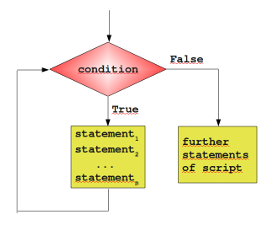

# Python3 循环语句

* Python中的循环语句有 for 和 while。
* Python循环语句的控制结构图如下所示：

  

### 一、while循环

* Python 中 while语句 的一般形式：

      while 判断条件：
          语句
    
    * 注意冒号和缩进。另外，在Python中没有 do..while 循环。 
    
* 实例（使用了 while 来计算 1 到 100 的总和）

     >eg:

      n = 1
      sum = 0
      while n <= 100:
          sum += n
          n += 1

      print("1 到 %d 之和为: %d" % (n-1,sum))

     >以上实例输出结果：

      1 到 100 之和为: 5050

### 二、while 循环使用 else 语句

* `while … else`在条件语句为 false 时执行 else 的语句块：

* 实例

     >eg:

      num = 0
      while num < 5:
          print(num,"小于 5")
          num += 1
      else:
          print(num,"大于 5")

     >以上实例输出结果：

      0 小于 5
      1 小于 5
      2 小于 5
      3 小于 5
      4 小于 5
      5 大于 5

### 三、简单语句组

* 类似if语句的语法，如果你的while循环体中只有一条语句，你可以将该语句与while写在同一行中， 如下所示：

     >eg:

      flag = 1
      while (flag):print("hello world!")
      print("bye!")

     >以上实例输出结果：

      hello world!
      hello world!
      hello world!
      hello world!
      hello world!
      ......

### 四、for语句

* Python `for循环`可以遍历任何序列的项目，如一个列表或者一个字符串。
* for循环的一般格式如下：

      for <variable> in <sequence>:
          <statements>
      else:
          <statements>

* Python loop循环实例：

     >eg:

      lanuage = ["C","C++","java","Python","SQL","javaScripts"]
      for x in lanuage:
          print(x)

     >以上实例输出结果：

      C
      C++
      java
      Python
      SQL
      javaScripts

* 以下 for 实例中使用了 break 语句，break 语句用于跳出当前循环体：

     >eg:

      lanuage = ["C","C++","java","Python","SQL","javaScripts"]
      for x in lanuage:
          if x == 'SQL':
              print("数据库语言！")
              break
          print("循环语句：" + x)
      else:
          print("没有循环数据！")
      print("完成循环！")

     >以上实例输出结果：

      循环语句：C
      循环语句：C++
      循环语句：java
      循环语句：Python
      数据库语言！
      完成循环！

### 五、`range()`函数（生成数列）

* 1、如果你需要遍历数字序列，可以使用内置range()函数。它会生成数列，例如: 

     >eg:

      for i in range(5):
          print(i)

     >以上实例输出结果：

      0
      1
      2
      3
      4

* 2、也可以使用 `range` 指定区间的值：

     >eg:

      for i in range(5,9):
          print(i)

     >以上实例输出结果：

      5
      6
      7
      8

* 3、也可以使range以指定数字开始并指定不同的增量(甚至可以是负数，有时这也叫做'步长'): 
    * 1）正数：

         >eg: 

          for i in range(0,10,3):
              print(i)

         >以上实例输出结果：

          0
          3
          6
          9

    * 2）负数：

         >eg: 

          for i in range(-10,-100,-30):
              print(i)

         >以上实例输出结果：

          -10
          -40
          -70

* 4、结合 `range()` 和 `len()` 函数以遍历一个序列的索引,如下所示:

     >eg:

      a = ['hello','world','sunny','and','good']

      for i in range(len(a)):
          print(i,a[i])

     >以上实例输出结果：

      0 hello
      1 world
      2 sunny
      3 and
      4 good

* 5、还可以使用`range()`函数来创建一个列表：

     >eg:

      a = list(range(5))
      print(a)

     >以上实例输出结果：

      [0, 1, 2, 3, 4]

### 六、break和continue语句及循环中的else子句

* 1、break 语句可以跳出 for 和 while 的循环体。如果从 for 或 while 循环中终止，任何对应的循环 else 块将不执行。 实例如下： 

     >eg:

      for temp in "sunnyandgood":
          if(temp=="a"):
              break
          print("当前字母为:",temp)

      var = 10
      while(var > 0):
          if(var==5):
              break
          print("当前变量的值为：",var)
          var -= 1
      print("bye!")

     >以上实例输出结果：

      当前字母为: s
      当前字母为: u
      当前字母为: n
      当前字母为: n
      当前字母为: y
      当前变量的值为： 10
      当前变量的值为： 9
      当前变量的值为： 8
      当前变量的值为： 7
      当前变量的值为： 6
      bye!

* 2、continue 语句被用来告诉Python跳过当前循环块中的剩余语句，然后继续进行下一轮循环。 

     >eg:

      for temp in "sunnyandgood":
          if(temp=="a"):
              continue
          print("当前字母为:",temp)

      var = 10
      while(var > 0):
          var -= 1
          if(var==5):
              continue
          print("当前变量的值为：",var)
      print("bye!")

     >以上实例输出结果：

      当前字母为: s
      当前字母为: u
      当前字母为: n
      当前字母为: n
      当前字母为: y
      当前字母为: n
      当前字母为: d
      当前字母为: g
      当前字母为: o
      当前字母为: o
      当前字母为: d
      当前变量的值为： 9
      当前变量的值为： 8
      当前变量的值为： 7
      当前变量的值为： 6
      当前变量的值为： 4
      当前变量的值为： 3
      当前变量的值为： 2
      当前变量的值为： 1
      当前变量的值为： 0

* 3、循环语句可以有 else 子句，它在穷尽列表(以for循环)或条件变为 false (以while循环)导致循环终止时被执行,但循环被break终止时不执行。 

     >eg:

      for num in range(2,10):
          for x in range(2,num):
              if(num % x ==0):
                  print(num , "等于" , x , "*" , num//x)
                  break
          else:
              # 循环中没有找到元素
              print(num , " 是质数")

     >以上实例输出结果：

      2  是质数
      3  是质数
      4 等于 2 * 2
      5  是质数
      6 等于 2 * 3
      7  是质数
      8 等于 2 * 4
      9 等于 3 * 3

### 7、pass 语句

* Python pass是空语句，是为了保持程序结构的完整性。
* pass 不做任何事情，一般用做占位语句，如下实例

     >eg:

      while True:
          pass    # 等待键盘中断 (Ctrl+C)

    * 最小的类
    
         >eg:

          class EmptyClass:
              pass

    * 以下实例在字母为 `n` 时 执行 pass 语句块:

         >eg:

          for temp in "sunnyandgood":
              if(temp == "n"):
                  pass
                  print("执行pass块")
              print("当前字母：",temp)
          print("bye!")

         >以上实例输出结果：

          当前字母： s
          当前字母： u
          执行pass块
          当前字母： n
          执行pass块
          当前字母： n
          当前字母： y
          当前字母： a
          执行pass块
          当前字母： n
          当前字母： d
          当前字母： g
          当前字母： o
          当前字母： o
          当前字母： d
          bye!

