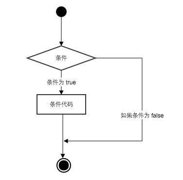

# Python3 条件控制

* Python条件语句是通过一条或多条语句的执行结果（True或者False）来决定执行的代码块。
* 条件语句的执行过程:

  

### 一、if语句

* Python中if语句的一般形式如下所示：

      if condition_1:
          statement_block_1
      elif condition_2:
          statement_block_2
      else:
          statement_block_3
    * Python 中用 `elif` 代替了 `else if`，所以if语句的关键字为：`if – elif – else`。 
* if语句理解
    * 如果 "condition_1" 为 True 将执行 "statement_block_1" 块语句
    * 如果 "condition_1" 为False，将判断 "condition_2"
    * 如果"condition_2" 为 True 将执行 "statement_block_2" 块语句
    * 如果 "condition_2" 为False，将执行"statement_block_3"块语句

* 注意：
    * 1、每个条件后面要使用冒号 `:`，表示接下来是满足条件后要执行的语句块。
    * 2、使用缩进来划分语句块，相同缩进数的语句在一起组成一个语句块。
    * 3、在Python中没有`switch – case`语句。

* if实例

     >eg:

      var1 = 8
      if var1:
          print("1、if表达式条件为ture")
          print(var1)
      var2 = 0
      if var2:
          print("2、if表达式条件为ture")
          print(var2)
      print("bye!")

     >以上实例输出结果：

      1、if表达式条件为ture
      8
      bye!

    * 从结果可以看到由于变量 var2 为 0，所以对应的 if 内的语句没有执行。

* if实例（狗的年龄计算判断）

     >eg:

      age = int(input("请输入你家狗狗的年龄: "))
      print("")
      if age < 0:
          print("你是在逗我吧!")
      elif age == 1:
          print("相当于 14 岁的人。")
      elif age == 2:
          print("相当于 22 岁的人。")
      elif age > 2:
          human = 22 + (age -2)*5
          print("对应人类年龄: ", human)

      ### 退出提示
      input("点击 enter 键退出")

     >以上实例输出结果：

      请输入你家狗狗的年龄: 8

      对应人类年龄:  52
      点击 enter 键退出

* if中常用的操作运算符:

  <table>
     <tr>
        <td>操作符</td>
        <td>描述</td>
     </tr>
     <tr>
        <td><</td>
        <td>小于</td>
     </tr>
     <tr>
        <td><=</td>
        <td>小于或等于</td>
     </tr>
     <tr>
        <td>></td>
        <td>大于</td>
     </tr>
     <tr>
        <td>>=</td>
        <td>大于或等于</td>
     </tr>
     <tr>
        <td>==</td>
        <td>等于，比较对象是否相等</td>
     </tr>
     <tr>
        <td>!=</td>
        <td>不等于</td>
     </tr>
  </table>

* if实例（数字猜谜游戏）

     >eg:

      # 该实例演示了数字猜谜游戏
      number = 7
      guess = -1
      print("数字猜谜游戏!")
      while guess != number:
          guess = int(input("请输入你猜的数字："))

          if guess == number:
              print("恭喜，你猜对了！")
          elif guess < number:
              print("猜的数字小了...")
          elif guess > number:
              print("猜的数字大了...")

     >以上实例输出结果：

      数字猜谜游戏!
      请输入你猜的数字：6
      猜的数字小了...
      请输入你猜的数字：8
      猜的数字大了...
      请输入你猜的数字：7
      恭喜，你猜对了！

### 二、if嵌套

* 在嵌套 if 语句中，可以把 if...elif...else 结构放在另外一个 if...elif...else 结构中。 

      if 表达式1:
          语句
          if 表达式2:
              语句
          elif 表达式3:
              语句
          else:
              语句
      elif 表达式4:
          语句
      else:
          语句

* 实例

     >eg:

      num = int(input("输入一个数字："))
      if num%2==0:
          if num%3==0:
              print ("你输入的数字可以整除 2 和 3")
          else:
              print ("你输入的数字可以整除 2，但不能整除 3")
      else:
          if num%3==0:
              print ("你输入的数字可以整除 3，但不能整除 2")
          else:
              print  ("你输入的数字不能整除 2 和 3")

     >以上实例输出结果：

      输入一个数字：12
      你输入的数字可以整除 2 和 3

